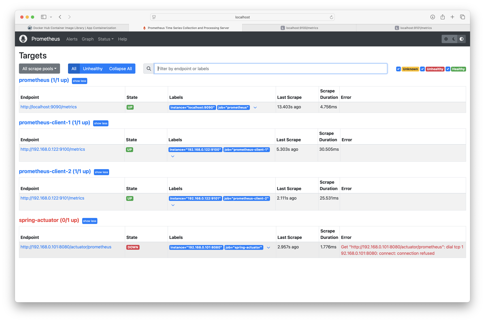

# Resources

- [Prometheus](https://prometheus.io/)
  - [Downloads](https://prometheus.io/download/)
- [Awesome Prometheus Alerts](https://samber.github.io/awesome-prometheus-alerts/rules.html)
- [aussiearef/Prometheus](https://github.com/aussiearef/Prometheus)
- [aussiearef/ShoeHubV2](https://github.com/aussiearef/ShoeHubV2)
- [prometheus-community/windows_exporter](https://github.com/prometheus-community/windows_exporter)
  - [WMI](https://learn.microsoft.com/en-us/windows/win32/wmisdk/wmi-start-page)
- [Installing prometheus pushgateway on Ubuntu 22.04 LTS](https://www.devopstricks.in/installing-prometheus-pushgateway-on-ubuntu-22-04-lts/)

# Setup

A prometheus server with two client nodes.

```
$
$ docker ps
CONTAINER ID   IMAGE                     COMMAND                  CREATED             STATUS              PORTS                    NAMES
437e19b3530a   ubuntu-node-exporter      "/app/node_exporter-…"   13 seconds ago      Up 12 seconds       0.0.0.0:9100->9100/tcp   prometheus-client-1
dd87d5a0adcb   ubuntu-node-exporter      "/app/node_exporter-…"   13 minutes ago      Up 13 minutes       0.0.0.0:9101->9100/tcp   prometheus-client-2
9d865ac0f1b4   prom/prometheus:v2.55.1   "/bin/prometheus --c…"   About an hour ago   Up About a minute   0.0.0.0:9090->9090/tcp   prometheus-v2
$
```

To run the prometheus server (version 2) container (make sure `prometheus.yml` exists inside `config` directory), I am using bind mount here so that we can modify the yaml file easily and restart the container to take effect of latest changes:

```
$ docker container run -d -p 9090:9090 -v "$HOME/prometheus/config:/etc/prometheus" --name prometheus-v2 prom/prometheus:v2.55.1
```

Use the docker file of ubuntu-node-exporter to build the ubuntu client image and run the container:

```
$ docker run -d -p 9100:9100 --name prometheus-client-1 ubuntu-node-exporter
$ docker run -d -p 9101:9100 --name prometheus-client-2 ubuntu-node-exporter
```

